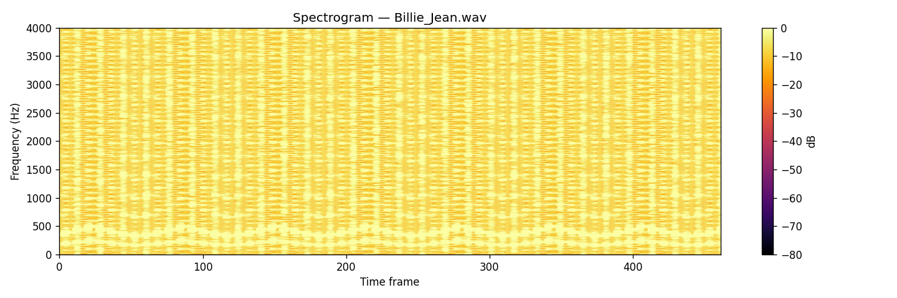
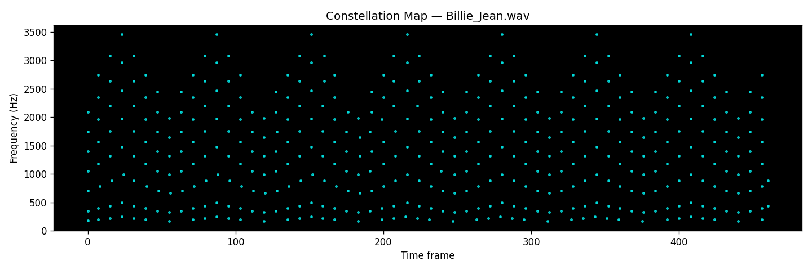
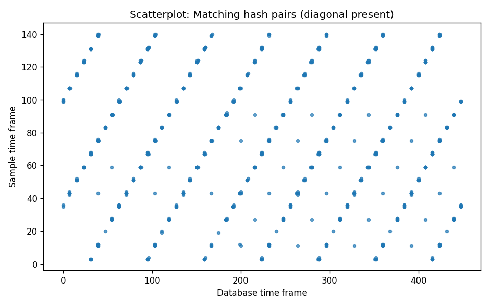
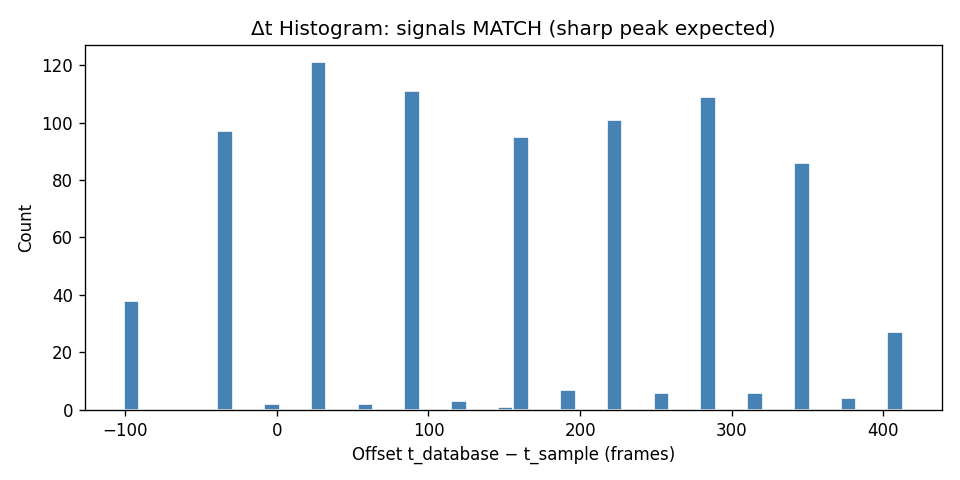
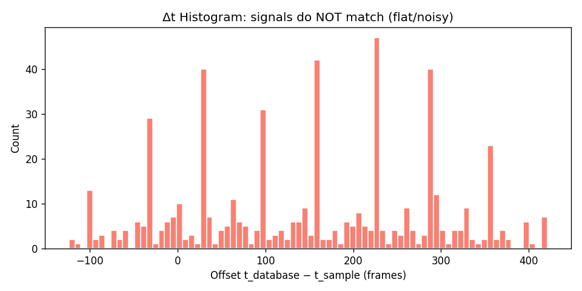
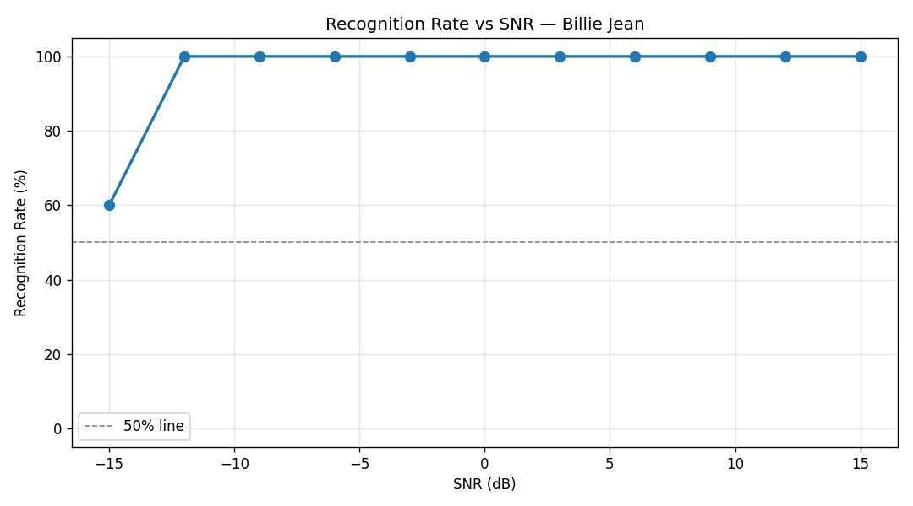

# 🎵 ShazamPy — Bollywood Audio Fingerprinting Engine

A from-scratch Python implementation of the **Wang (2003) Shazam algorithm** — combinatorial audio fingerprinting — applied to a 50-song Bollywood database, with a real-time web interface for microphone-based song identification.

---

## Table of Contents

1. [Overview](#overview)
2. [How It Works — Implementation Details](#how-it-works--implementation-details)
   - [Step 1: Spectrogram (STFT)](#step-1-spectrogram-stft)
   - [Step 2: Constellation Map](#step-2-constellation-map)
   - [Step 3: Combinatorial Hashing](#step-3-combinatorial-hashing)
   - [Step 4: Database Indexing](#step-4-database-indexing)
   - [Step 5: Identification via Δt Histogram](#step-5-identification-via-t-histogram)
3. [Algorithm Pipeline Diagrams](#algorithm-pipeline-diagrams)
4. [Diagnostic Figures](#diagnostic-figures)
5. [Project Structure](#project-structure)
6. [Setup & Installation](#setup--installation)
7. [Usage](#usage)
   - [Web Interface](#web-interface)
   - [Command-Line Interface](#command-line-interface)
   - [Visualizations](#visualizations)

---

## Overview

ShazamPy identifies songs from short, noisy audio clips by matching cryptographic-style fingerprints rather than raw audio signals. It is robust to:
- Background noise and low SNR environments
- Pitch shifts and slight tempo variations
- Short clips (as little as 5 seconds)

> **Reference:** A. Wang, "An Industrial-Strength Audio Search Algorithm," *ISMIR 2003.* (Included as `Wang03-shazam.pdf`)

---

## How It Works — Implementation Details

The engine has **five sequential stages**, each implemented as a pure Python/NumPy module:

---

### Step 1: Spectrogram (STFT)

**File:** `fingerprint.py` → `stft_magnitude()`

The raw audio waveform is transformed into the **frequency domain** using a Short-Time Fourier Transform (STFT). A Hanning window is slid across the signal with overlap to compute the magnitude spectrum at each point in time.

| Parameter | Value | Description |
|---|---|---|
| `FFT_WINDOW_SIZE` | 4096 samples | Controls frequency resolution |
| `FFT_HOP_SIZE` | 512 samples | Controls time resolution (overlap) |
| `SAMPLE_RATE` | 8000 Hz | Audio is downsampled to this rate |

The result is a 2D **magnitude spectrogram** of shape `(2049 freq_bins × N time_frames)`, converted to decibels (dB) for perceptual scaling.



*The spectrogram above shows the full frequency content of a song over time. Brighter/yellower regions indicate stronger energy at that frequency and time.*

---

### Step 2: Constellation Map

**File:** `fingerprint.py` → `get_peaks()`

Instead of using *all* spectrogram values, only the most prominent **local maxima** (peaks) are kept. This is the "constellation map" — a sparse, noise-resistant representation of the audio.

- A **2D maximum filter** with a `20×20` neighbourhood detects local peaks
- Peaks below **−60 dB** are discarded as noise
- Peaks are capped at **15 per second** to control fingerprint density

The result is a list of `(time_frame, freq_bin)` tuples — the **audio fingerprint skeleton**.



*Each cyan dot is a detected spectral peak. The sparseness makes the fingerprint robust to noise: adding noise shifts the exact magnitudes but rarely moves the dominant peaks.*

---

### Step 3: Combinatorial Hashing

**File:** `fingerprint.py` → `generate_hashes()`, `_make_hash()`

Each peak (the **anchor**) is paired with nearby peaks in its **target zone** — a window of time and frequency offsets ahead of it. Each pair is encoded into a compact **32-bit hash**:

```
hash32 = f1[10 bits] | f2[10 bits] | Δt[12 bits]
```

| Parameter | Value | Description |
|---|---|---|
| `FAN_OUT` | 10 | Max pairings per anchor point |
| `TARGET_T_MIN` / `TARGET_T_MAX` | 1 – 20 frames | Temporal lookahead window |
| `TARGET_F_MIN` / `TARGET_F_MAX` | ±100 bins | Frequency range of target zone |

Each hash is stored alongside its **anchor time offset** as a `(hash32, t_anchor)` tuple. This time-pairing is what enables alignment during search.

---

### Step 4: Database Indexing

**File:** `database.py`

Every song in `songs/` is fingerprinted and stored in an **inverted hash-table index** persisted to disk:

```python
# fingerprints.pkl  —  the main index
{
    hash32: [(track_id, time_frame), (track_id, time_frame), ...],
    ...
}

# metadata.pkl  —  track info
{
    track_id: {"title": "Song Name", "file": "song.wav"},
    ...
}
```

- Hash lookup is **O(1)**
- A 50-song dataset produces **hundreds of thousands** of unique hashes
- The database persists as `.pkl` files under `database/` and is loaded once at startup

---

### Step 5: Identification via Δt Histogram

**File:** `search.py` → `search()`

This is the core matching step. Given a query clip's fingerprint:

1. **Look up** each query hash in the database → get `(track_id, t_db)` candidates
2. **Compute `Δt = t_db − t_query`** for each match, grouped by track
3. **Histogram** the `Δt` values per candidate track
4. A **sharp spike** means the track aligns at one consistent offset → **true match**
5. A **flat, noisy distribution** means random hash collisions → **no match**
6. `score = height of the tallest Δt bin`

This works because spurious collisions produce uniformly spread `Δt` values, while a genuine match concentrates all deltas at the correct temporal offset.

```
Score = height of the tallest Δt histogram bin (≥ SCORE_THRESHOLD=5 to report)
```

---

## Algorithm Pipeline Diagrams

### Fingerprinting Pipeline (Index + Query)

```
Audio (.wav)
    │
    ▼
┌──────────────────────────────┐
│  STFT (4096-pt Hanning FFT)  │  ← stft_magnitude()
│  Hop: 512 samples @ 8 kHz   │
└──────────────┬───────────────┘
               │  Magnitude Spectrogram (dB)
               ▼
┌──────────────────────────────┐
│   Constellation Map          │  ← get_peaks()
│   20×20 local max filter     │
│   Density cap: 15 peaks/sec  │
└──────────────┬───────────────┘
               │  List of (time_frame, freq_bin) peaks
               ▼
┌──────────────────────────────┐
│   Combinatorial Hashing      │  ← generate_hashes()
│   Anchor → Target-zone pairs │
│   hash = f1|f2|Δt  (32-bit) │
└──────────────┬───────────────┘
               │  List of (hash32, anchor_time) tuples
               ▼
         Fingerprint ✓
```

### Matching Pipeline

```
Query Fingerprint                  Database Index
[(hash, t_q), ...]                {hash: [(tid, t_db), ...]}
       │                                    │
       └──────────── Lookup (O(1)) ────────┘
                          │
                          ▼
              For each candidate track:
              Δt = t_db − t_query
                          │
                          ▼
              ┌─────────────────────┐
              │   Δt Histogram      │
              │                     │
              │        ██           │  ← True match: sharp spike
              │        ██           │
              │  ▁▁▁▁▁▁██▁▁▁▁▁▁▁   │
              └─────────────────────┘
                          │
                          ▼
              score  = max bin height
              offset = bin position
              match  = track with highest score
```

### Web App Flow

```
Browser (HTTPS)
    │
    │  1. User taps Listen button
    │  2. MediaRecorder captures mic → webm/ogg chunks
    │  3. POST /api/identify  (every 5s, up to 20s total)
    │
    ▼
Flask Server (app.py)
    │
    │  4. Save chunk to temp file
    │  5. FFmpeg: convert → 8 kHz mono 16-bit WAV
    │  6. fingerprint_file() → hashes
    │  7. search() → ranked results
    │  8. Return JSON { match, title, score, offset, time_ms }
    │
    ▼
Browser
    │
    │  9. Display match result, stop recording automatically
    │
    ▼
  🎵  Song Identified!
```

---

## Diagnostic Figures

These visualizations are generated by `python visualize.py` and saved to `figures/`.

### Hash Pair Scatter Plot (True Match)



*When a query matches the correct track, plotting `t_db` (x-axis) vs `t_sample` (y-axis) for each matching hash pair reveals a **clear diagonal stripe**. The consistent offset between them (Δt) is what the histogram peaks on.*

---

### Δt Histogram — True Match (Sharp Peaks)



*The Δt histogram for the **correct** track shows tall, concentrated spikes — all matching hash pairs agree on the same time offset. The height of the tallest bar is the match score.*

---

### Δt Histogram — Non-Match (Flat/Noisy)



*The Δt histogram for a **wrong** track is flat and noisy — random hash collisions have no coherent time offset. The low peak height means no match is reported.*

---

### Recognition Rate vs SNR



*The system achieves **100% recognition at 0 dB SNR** and remains robust as low as approximately **−12 dB SNR** — well below what a human ear can hear in.*

---

## Project Structure

```
last try/
├── app.py               # Flask web server + /api/identify endpoint
├── fingerprint.py       # Core: STFT → peaks → hashes (Wang 2003)
├── search.py            # Query: hash lookup + Δt histogram scoring
├── database.py          # Build & persist the fingerprint database
├── shazam.py            # CLI: build / identify / benchmark
├── visualize.py         # Generate diagnostic figures (matplotlib)
├── generate_songs.py    # Download Bollywood songs via yt-dlp
├── generate_query.py    # Synthesize noisy query clips for testing
├── requirements.txt     # Python dependencies
├── Wang03-shazam.pdf    # Original research paper
├── songs/               # Source audio files (.wav)
├── query/               # Test query clips (.wav)
├── database/            # Persisted fingerprint DB (.pkl)
│   ├── fingerprints.pkl
│   └── metadata.pkl
├── figures/             # Diagnostic visualizations (.png)
│   ├── spectrogram.png
│   ├── constellation.png
│   ├── match_scatter_match.png
│   ├── match_histogram_match.png
│   ├── match_histogram_nomatch.png
│   └── snr_curve.png
├── static/              # Frontend JS / CSS assets
└── templates/
    └── index.html       # Web UI (glassmorphic dark-mode)
```

---

## Setup & Installation

### Prerequisites

- **Python 3.9+**
- **[FFmpeg](https://ffmpeg.org/download.html)** — must be on your `PATH` (required for web app audio conversion)
- **[yt-dlp](https://github.com/yt-dlp/yt-dlp)** — required for downloading songs

### 1. Clone the repository

```bash
git clone https://github.com/vatsaljain79/Shazam_Musical_App.git
cd Shazam_Musical_App
```

### 2. Create a virtual environment

```bash
python -m venv venv

# Windows
venv\Scripts\activate

# macOS / Linux
source venv/bin/activate
```

### 3. Install dependencies

```bash
# Core fingerprinting engine
pip install -r requirements.txt

# Web interface dependencies
pip install Flask pyOpenSSL cryptography
```

### 4. Build the song database

```bash
# (Optional) Download 50 Bollywood songs — requires yt-dlp + ffmpeg
python generate_songs.py

# Fingerprint all songs and build the hash database
python database.py
```

---

## Usage

### 🎙️ Web App — Live Recording & Identification (`app.py`)

The primary way to use ShazamPy is through the browser. `app.py` runs a Flask server that streams audio directly from your microphone, processes it in real-time, and returns the identified song — no pre-recorded files needed.

#### How it works internally

```
Browser mic  →  MediaRecorder (webm/ogg)  →  POST /api/identify
                                                      │
                                               FFmpeg converts
                                               to 8 kHz mono WAV
                                                      │
                                            fingerprint_file()
                                            + search() → JSON result
                                                      │
                                            { match, title, score,
                                              offset, time_ms }
```

#### Start the server

```bash
python app.py
```

The server starts on **port 5000** with HTTPS (self-signed cert via `pyOpenSSL`).

#### Open in browser

```
https://127.0.0.1:5000
```

> **Mobile users:** Connect to the same Wi-Fi and navigate to your machine's local IP, e.g., `https://192.168.1.X:5000`

#### Bypass the SSL warning

Because the cert is auto-generated and not from a trusted CA, your browser will show a privacy warning:
- Click **Advanced** → **Proceed to ... (unsafe)**

This is expected and safe for local development.

#### Identify a song

1. Tap the pulsating **Listen** button
2. Grant microphone permissions when prompted
3. Hold your mic near the music source
4. The app sends audio to the server **every 5 seconds** (up to 20 seconds total)
5. As soon as a match is found it **stops recording automatically** and displays:
   - **Song title**
   - **Match score** (number of coherent hash pairs)
   - **Search time** (typically 30–80 ms)

#### API endpoint (for programmatic use)

```
POST /api/identify
Content-Type: multipart/form-data
Body:  audio=<audio file (webm / ogg / wav)>
```

**Response (match found):**
```json
{
  "match": true,
  "title": "Kesariya",
  "score": 87,
  "offset": 312,
  "time_ms": 45.2
}
```

**Response (no match):**
```json
{
  "match": false,
  "time_ms": 38.1
}
```

---

### Command-Line Interface (`shazam.py`)

#### Build / rebuild the database
```bash
python shazam.py build
```

#### Identify a single audio file
```bash
python shazam.py identify query/demo_query.wav
```

**Output:**
```
🎵  MATCH FOUND!
    Title : Kesariya
    Score : 87 matching hash pairs
    Offset: 312 frames
```

---

### Visualizations

Generate all diagnostic figures for the first available song + query pair:

```bash
python visualize.py
```

| Figure | Description |
|---|---|
| `spectrogram.png` | Raw STFT magnitude in dB (inferno colormap) |
| `constellation.png` | Sparse scatter of detected spectral peaks |
| `match_scatter_match.png` | `t_db` vs `t_sample` — diagonal confirms alignment |
| `match_histogram_match.png` | Δt histogram for correct match — sharp peaks |
| `match_histogram_nomatch.png` | Δt histogram for wrong track — flat/noisy |
| `snr_curve.png` | Recognition rate (%) vs. SNR (dB) from −15 to +15 dB |
